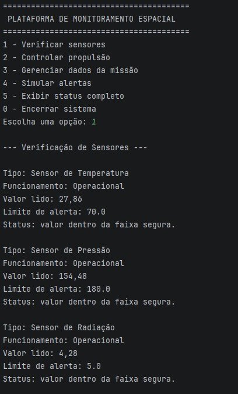
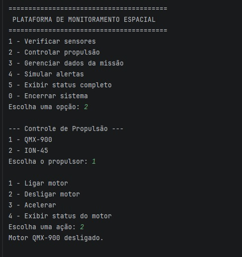
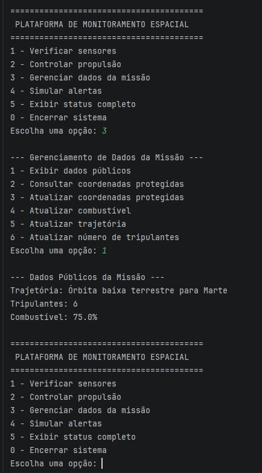
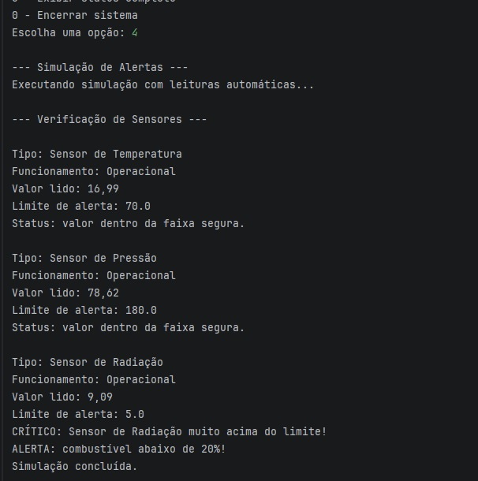
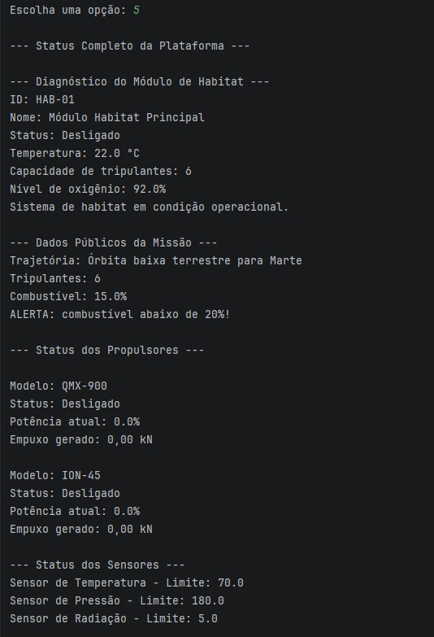

# GS POO - Plataforma de Monitoramento Espacial

Projeto desenvolvido para a Global Solution da disciplina de Programação Orientada a Objetos em Java.

O sistema simula uma plataforma de monitoramento de sistemas espaciais, permitindo verificar sensores, controlar sistemas de propulsão, gerenciar dados da missão e emitir alertas automáticos quando valores críticos são identificados.

---

## Objetivo do Projeto

O objetivo é aplicar os principais conceitos de Programação Orientada a Objetos em Java dentro de um cenário de monitoramento espacial.

A plataforma foi construída para simular o funcionamento de uma estação ou nave espacial, onde diferentes componentes precisam ser monitorados para garantir a segurança da missão.

---

## Integrantes e Divisão de Tarefas

| Integrante | Responsabilidade |
|---|---|
| Matheus | Desenvolvimento dos sensores e do sistema de propulsão |
| Lucas | Desenvolvimento da classe de dados da missão |
| Henrique | Ajustes e integração do sistema principal |

As responsabilidades de cada integrante foram desenvolvidas individualmente, conforme a divisão definida no projeto. Após a conclusão das partes, os códigos foram revisados e unificados em um único commit para manter a organização do repositório, facilitar a integração dos arquivos e evitar conflitos desnecessários no histórico do projeto.

---

## Conceitos de POO Aplicados

### Classe Abstrata

O projeto utiliza classes abstratas para representar estruturas base que não devem ser instanciadas diretamente.

Classes abstratas criadas:

- `ComponenteEspacial`
- `SistemaPropulsao`

A classe `ComponenteEspacial` define atributos comuns aos componentes espaciais, como:

- id
- nome
- status
- temperatura

Também possui métodos concretos, como:

- `ligar()`
- `desligar()`

E método abstrato, obrigando as subclasses a implementarem seu próprio comportamento.

A classe `SistemaPropulsao` define a base para diferentes tipos de propulsão, permitindo que cada sistema tenha uma forma própria de acelerar e calcular empuxo.

---

### Interface

Foi criada a interface `Sensor`, que define os métodos obrigatórios para todos os sensores do sistema.

Métodos definidos na interface:

- `lerValor()`
- `verificarFuncionamento()`
- `retornarTipo()`
- `verificarAlerta()`

Classes que implementam a interface:

- `SensorTemperatura`
- `SensorPressao`
- `SensorRadiacao`

Cada sensor possui sua própria leitura simulada, limite de alerta e verificação de funcionamento.

---

### Encapsulamento

O encapsulamento foi aplicado principalmente na classe `DadosMissao`.

Todos os atributos da classe são privados e acessados por métodos getters e setters com validação.

A classe protege informações sensíveis da missão, como:

- coordenadas
- código de acesso
- nível de combustível
- trajetória
- número de tripulantes

As coordenadas só podem ser acessadas mediante o código correto.

Também há validações para impedir dados inválidos, como:

- combustível negativo
- combustível acima de 100%
- número de tripulantes negativo
- código de acesso vazio

---

### Herança

A herança foi aplicada no sistema de propulsão.

A classe abstrata `SistemaPropulsao` serve como classe base para:

- `PropulsaoQuimica`
- `PropulsaoEletrica`

Cada tipo de propulsão sobrescreve o método `acelerar()` com comportamento específico.

Também foi utilizado `super()` para reaproveitar atributos e comportamentos da classe mãe.

---

## Funcionalidades do Sistema

### Sistema de Sensores

O sistema permite:

- leitura simulada de sensores
- verificação de funcionamento
- definição de limites de alerta
- detecção de valores acima do limite
- emissão de alertas no console

Sensores implementados:

- Sensor de Temperatura
- Sensor de Pressão
- Sensor de Radiação

---

### Sistema de Propulsão

O sistema permite:

- ligar motores
- desligar motores
- acelerar com porcentagem de potência entre 0 e 100
- validar valores inválidos
- calcular empuxo gerado
- aplicar comportamento diferente para cada tipo de propulsão

Tipos de propulsão implementados:

- Propulsão Química
- Propulsão Elétrica

---

### Dados da Missão

O sistema permite gerenciar:

- coordenadas protegidas por senha
- nível de combustível
- trajetória da missão
- número de tripulantes

Também há alerta automático quando o combustível fica abaixo de 20%.

Código padrão de acesso às coordenadas:

```text
1234
```

---

### Sistema de Alertas

O sistema possui alertas automáticos com diferentes níveis:

- ATENÇÃO
- ALERTA
- CRÍTICO

Os alertas são exibidos no console quando sensores ou dados da missão atingem valores fora dos limites esperados.

---

### Sistema Principal

A classe `SistemaMonitoramento` contém o menu principal do sistema.

Opções disponíveis no menu:

1. Verificar sensores
2. Controlar propulsão
3. Gerenciar dados da missão
4. Simular alertas
5. Exibir status completo
0. Sair

O sistema utiliza loop principal e leitura de entrada do usuário pelo console.

---

## Estrutura do Projeto

```text
projeto-espacial/
├── src/
│   ├── ComponenteEspacial.java
│   ├── DadosMissao.java
│   ├── ModuloHabitat.java
│   ├── PropulsaoEletrica.java
│   ├── PropulsaoQuimica.java
│   ├── Sensor.java
│   ├── SensorPressao.java
│   ├── SensorRadiacao.java
│   ├── SensorTemperatura.java
│   ├── SistemaMonitoramento.java
│   └── SistemaPropulsao.java
├── docs/
│   └── prints/
│       ├── 01-verificacao-sensores.png
│       ├── 02-controle-propulsao.png
│       ├── 03-dados-missao.png
│       ├── 04-simulacao-alertas.png
│       └── 05-status-completo.png
├── README.md
└── .gitignore
```

---

## Como Executar o Projeto

### 1. Clonar o repositório

```bash
git clone URL_DO_REPOSITORIO
```

### 2. Acessar a pasta do projeto

```bash
cd projeto-espacial
```

### 3. Compilar os arquivos Java

```bash
javac -d out src/*.java
```

### 4. Executar o sistema

```bash
java -cp out SistemaMonitoramento
```

---

## Evidências de Execução

### Verificação dos sensores

<p align="center">
  
</p>

### Controle de propulsão

<p align="center">
  
</p>

### Gerenciamento dos dados da missão

<p align="center">
  
</p>

### Simulação de alertas

<p align="center">
  
</p>

### Status completo da plataforma

<p align="center">
  
</p>

---

## Requisitos Técnicos

Para executar o projeto, é necessário ter instalado:

- Java JDK 8 ou superior
- Terminal, Prompt de Comando, PowerShell ou uma IDE Java

---

## Checklist dos Requisitos da GS

### Classe Abstrata

- [x] Criada a classe abstrata `ComponenteEspacial`
- [x] Definido pelo menos um método abstrato
- [x] Criada classe concreta que herda da classe abstrata
- [x] Uso correto de `extends`

### Interface

- [x] Criada a interface `Sensor`
- [x] Definidos métodos obrigatórios na interface
- [x] Interface implementada em três sensores diferentes
- [x] Uso correto de `implements`

### Encapsulamento

- [x] Atributos privados em `DadosMissao`
- [x] Getters e setters com validação
- [x] Proteção de dados sensíveis com código de acesso
- [x] Validação de valores inválidos

### Herança

- [x] Criada a classe abstrata `SistemaPropulsao`
- [x] Criados dois tipos diferentes de propulsão
- [x] Uso de `super()`
- [x] Cada tipo de propulsão possui atributos e comportamentos específicos

### Sistema de Alertas

- [x] Verificação automática dos sensores
- [x] Detecção de valores acima do limite
- [x] Emissão de alertas no console
- [x] Interface de interação com o usuário por menu

---

## Observações

Os valores dos sensores são simulados com números aleatórios, conforme permitido no enunciado da atividade.

O projeto não utiliza interface gráfica. Toda a interação ocorre pelo console, com menu de texto.

---

## Status do Projeto

Projeto finalizado e funcional para entrega da Global Solution de Programação Orientada a Objetos.
